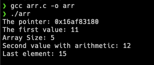
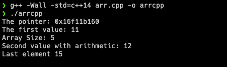

Array is derived data type that has been used anywhere due to its ability to constructed primitive data types (int, float, char) and grouped multiple value of the same type together.

There are multiple array implementation on other languages, like `list` in Python. But, we will take a look on how array behave on C/C++.

## How Array stored in memory?

One thing that we should know that, array stored collection of elements of the same data type in **contiguous memory locations**. What does it mean? When we declare an array, compiler will allocates contiguous block of memory to store its elements. For example,

```c
int data[5] = {11, 12, 13, 14, 15};
```

Each element will stored sequentially and occupied fixed amount of memory, in this case `int` occupied `4 bytes` for each element.

```bash
Memory Address: 1000   1004   1008   1012   1016
Values        :  11     12     13     14     15
```

## Array as pointer

In C/C++, the variable of the array is essentially a pointer to its first element. This is where pointer we said that array is just a pointer, because basically the variable itself is pointer to its first element.

```c
int data[5] = {11, 12, 13, 14, 15};
int *dataPtr = data;
```

the `dataPtr` will be a pointer of the first element of array `data` which is the element `11` . This `*data` is equivalent to `data[0]` .

## Pointer arithmetic to array access

With pointer arithmetic we can access the element of the array using the base pointer. Let’s see in this code

```c
int data[5] = {11, 12, 13, 14, 15};
int *dataPtr = data;
printf("%d\n", *dataPtr); // Print first element (11)
printf("%d\n", *(dataPtr + 1); // Print second element (12)
printf("%d\n", *(dataPtr + 2); // Print third element (12)
```

`*(dataPtr + i)` is equivalent to `data[i]` .

You can also access the last element without explicitly write the index, in below code to get the last element with add `dataPtr` with the size of the array minus 1, since array start at index 0, and then cast it to int. This operation `sizeof(data)/sizeof(data[0])` gets the byte size of array and divide it with its first element, in our case `sizeof(data)` will result `20 bytes` because there are 5 elements of integer where each of them occupied 4 bytes and `sizeof(data[0])` is typically 4 bytes on most systems, so `20 / 4` is 5 meaning there is 5 elements of the array. So the operation is equivalent to `data[4]` .

```c
int data[5] = {11, 12, 13, 14, 15};
int *dataPtr = data;
int lastElement = *(dataPtr + (int)(sizeof(data)/sizeof(data[0]) - 1));
printf("Last element %d\n", lastElement); // Output is 15
```

## Example code

### C

In C, you can use this code

```c
#include <stdio.h>

int main() {
    int data[5] = {11, 12, 13, 14, 15};
    int *dataPtr = data;
    int lastElement = *(dataPtr + (int)(sizeof(data)/sizeof(data[0]) - 1));

    printf("The pointer: %p\n", dataPtr);
    printf("The first value: %d\n", *dataPtr);

    printf("Array Size: %lu\n", (sizeof(data)/sizeof(data[0])));
    printf("Second value with arithmetic: %d\n", *(dataPtr + 1));
    printf("Last element: %d\n", lastElement);

    return 0;
}
```

Result as in the explanation above.



### C++

This also applied on C++, try this code

```cpp
#include <iostream>

int main() {
    int data[5] = {11, 12, 13, 14, 15};
    int *dataPtr = data;
    int lastElement = *(dataPtr + (int)(sizeof(data)/sizeof(data[0]) - 1));

    std::cout << "The pointer: " << dataPtr << std::endl;
    std::cout << "The first value: " << *dataPtr << std::endl;

    std::cout << "Array Size: " << (sizeof(data)/sizeof(data[0])) << std::endl;
    std::cout << "Second value with arithmetic: " << *(dataPtr + 1) << std::endl;
    std::cout << "Last element " << lastElement << std::endl;

    return 0;
}
```

The result is same as our C code



That’s will be all for this post, hope it helps you understand and learning new stuff, see you later, cheers 🍻🍻
