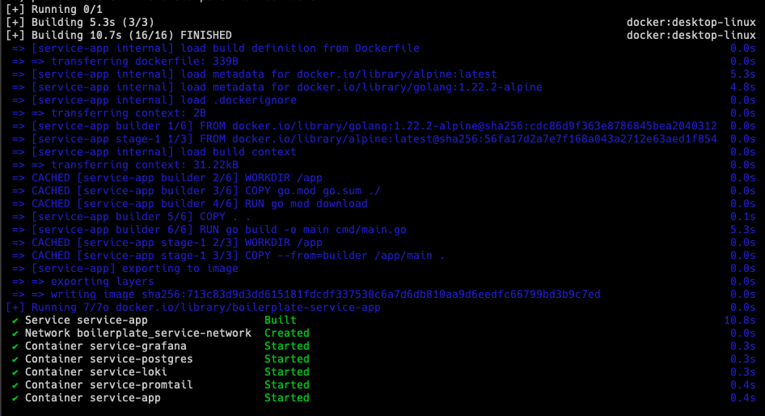
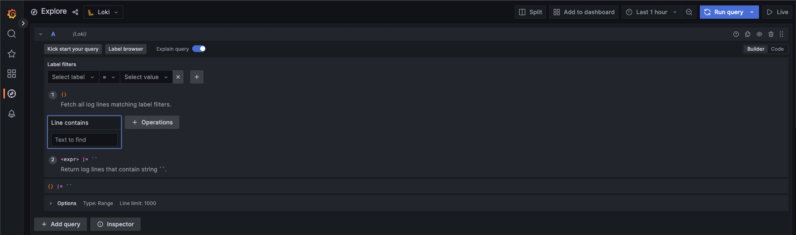
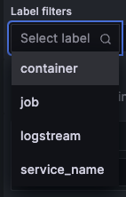
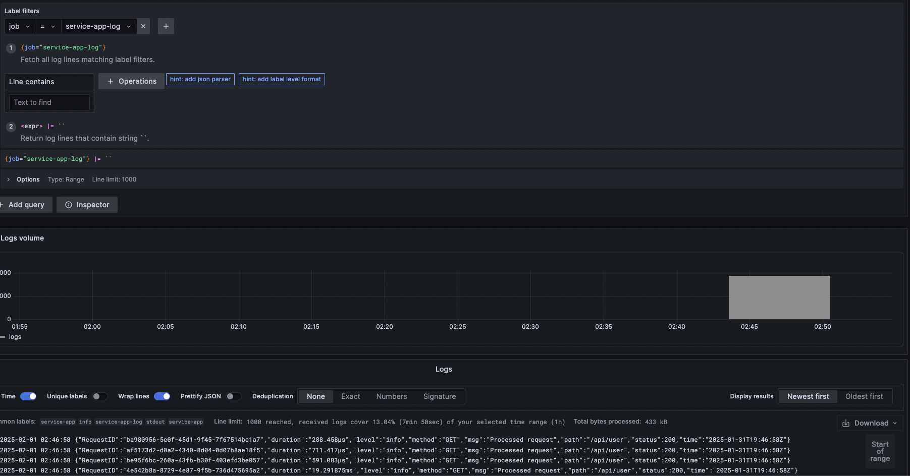
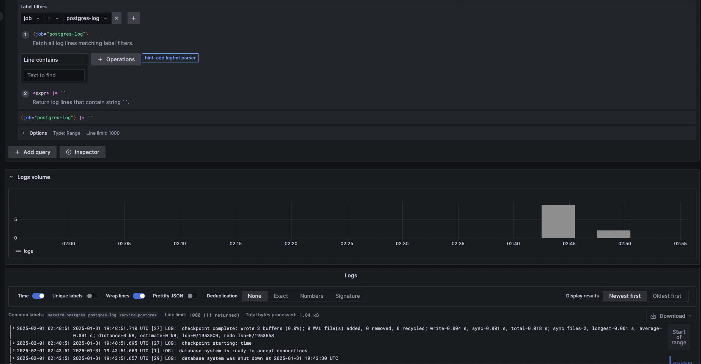

Debugging a service with less information to analyze could be pain in the ass, especially when there are multiple services communicate to each other. Sometimes we need to move from one server to another just to check the log files and analyze it or utilize `grep` . While obviously not everyone has access to the server itself.

Logging is the mandatory thing when building a service. Storing information about the state of the app itself. Like each error or step we thing important for our debugging process.

Observability lets you understand a system from the outside by letting you ask questions about that system without knowing its inner workings. Furthermore, it allows you to easily troubleshoot and handle novel problems, that is, “unknown unknowns”. It also helps you answer the question “Why is this happening?” ([opentelemetry](https://opentelemetry.io/docs/concepts/observability-primer/))

While there are several ready-to-use observability tools like Datadog, New Relic, and lot of them, most of them are paid. We will build our own observability with open-source technologies: Grafana, Loki, and Promtail.

We’ll be using a Go service that I’ve created as boilerplate, you can check in this [repository](https://github.com/chud-lori/go-boilerplate) .

## Grafana Labs

We will utilize all tools from Grafana Labs which are the Grafana Dashboard, Loki, and Promtail.

### Grafana Dashboard

Grafana is a platform that helps users to analyze, monitor, and visualize data. You can even create alerts right in Grafana. Grafana comes with a dashboard to keep everything organized. There is also a Grafana Cloud, a managed solution that handles the infrastructure for you but it does come at a cost.

### Loki

Loki is a log aggregation system designed to store and query logs from each configured services and infrastructure. Instead of storing logs on each server, we can store each of our services logs to Loki. Loki also comes with a query language, LogQL, to explore logs. To explore more detail about LogQL, check the [documentation](https://grafana.com/docs/loki/latest/query/).

### Promtail

Loki is not a scrapper tool. So, we need Promtail to do that job. Promtail is an agent which ships the contents of local logs to a private Grafana Loki instance. It usually deployed to every machine that runs services which need to be monitored. Promtail will collects each log and filter if needed before push log data to Loki.

## Code

### Go Service

I have created a go service boilerplate in this [repository](https://github.com/chud-lori/go-boilerplate). Try to clone and run it, create `.env` and make sure the service is running.

Create a `.env` file, you can check the template in `keys.env` . Let’s create it with something like this:

```bash
PSQL_USER=postgres
PSQL_PASSWORD=postgres
PSQL_HOST=host.docker.internal
DB_NAME=service_db
APP_PORT=1234
```

Make sure you are familiar with Docker and have it installed locally

Try build the docker compose

```bash
docker compose up --build -d
```

Make sure the containers are created. The app should run on port `1234` , let’s check one endpoint using `curl`

```bash
curl --location --request GET 'http://127.0.0.1:1234/api/user' \
--header 'x-api-key: secret-api-key' \
--header 'Content-Type: application/json'
```

If you found any error, check the app log `docker logs service-app --follow` or you can create issue in the github repository, I will fix it right away.

If all’s good, let’s write the `yml`

### Grafana

In Grafana, there’s a bit configuration to make the Loki as datasource automatically in Grafana instead of set it manually. Create a file `grafana-datasources.yml`

```yaml
apiVersion: 1

datasources:
  - name: Loki
    type: loki
    access: proxy
    url: http://service-loki:3100
    version: 1
    editable: false
    isDefault: true
```

Basically this code is to set the data source come from. In `url` field there is where the Loki server running and its port. Disable to edit data on `editable`  and make Loki default data source on `isDefault` .

### Promtail

Write the Promtail yaml file and named it `promtail.yml`

```yaml
# Server configuration, Promtail will listen to http port 9080
server:
  http_listen_port: 9080
  grpc_listen_port: 0
  log_level: debug

# Promtail uses a positions file to keep track of where it left off reading log files
# Ensuring if Promtail restarts, it can continue from where it stopped and the file stored at /tmp/positions.yaml
positions:
  filename: /tmp/positions.yaml

# Specify the Loki server endpoint where it run  on port 3100
# "service-loki" is our service name in docker compose
clients:
  - url: http://service-loki:3100/loki/api/v1/push

# This is the section of the scrapping process
scrape_configs:
  # scrapping job name, a unique identifier for the scrapping job, you can have more than one
  - job_name: service_scrape
  # Promtail connects to the Docker daemon using the Unix socket at /var/run/docker.sock to discover running containers
  # It will list of running containers every 5 seconds
  # Filters the container based on Docker labels, here it only selects containers with the label "logging=service-promtail"
    docker_sd_configs:
      - host: unix:///var/run/docker.sock
        refresh_interval: 5s
        filters:
          - name: label
            values: ["logging=service-promtail"]
    # Relabeling is used to modify or add labels to log before sending to Loki
    relabel_configs:
      # Extract the container name from metadata
      # uses regex to remove "/" from container name, example from "/service" to "service"
      # stores the result in a new label called "container"
      - source_labels: ['__meta_docker_container_name']
        regex: '/(.*)'
        target_label: 'container'
      # Extract the docker log stream like stdout and stderr
      # store the result in another new label "logstream"
      - source_labels: ['__meta_docker_container_log_stream']
        target_label: 'logstream'
      # Extract the value of Docker label "logging_jobname" from container metadata
      # store to label "job"
      - source_labels: ['__meta_docker_container_label_logging_jobname']
        target_label: 'job'

```

You can read the explanation on code comments, but let me try to break down.

In this section, we configure the Promtail server. Promtail listen to http port 9080, disables gRPC listening which set to 0 and set the logging level to `debug` to get verbose information.

```yaml
server:
  http_listen_port: 9080
  grpc_listen_port: 0
  log_level: debug
```

Promtail uses a positions file to keep track of where it left off reading log files. It ensures if Promtail restarts, it can continue from where it stopped and the file stored at `/tmp/positions.yaml` .

```yaml
positions:
  filename: /tmp/positions.yaml
```

This line contains the scraping configuration. We set the job_name, a unique identifier scrapping job. In our case we set to `service_scrape`

Since we us Docker, we will use the Docker Service Discovery. This will allows Promtail to automatically discover and collect logs from Docker containers. Promtail will connects to the Docker daemon using the Unix socket at `/var/run/docker.sock` to discover running containers.

It will refresh the running containers every 5 seconds and filters the container based on the Docker label. Here we will filter by label `logging-service-promtail`

```yaml
scrape_configs:
  - job_name: service_scrape
    docker_sd_configs:
      - host: unix:///var/run/docker.sock
        refresh_interval: 5s
        filters:
          - name: label
            values: ["logging=service-promtail"]
```

In this section is relabeling. It uses to modify or add labels to log before sending to Loki. We create 3 labels.

First is `container`  which will extract container name from metadata and uses regex to remove `/`  from container name.

Second label is `logstream` which will extract docker log stream like `stdout` and `stderr` .

Third label is `job` which will the value of Docker label `"logging_jobname"` from container metadata.

```yaml
  relabel_configs:
    - source_labels: ['__meta_docker_container_name']
      regex: '/(.*)'
      target_label: 'container'
    - source_labels: ['__meta_docker_container_log_stream']
      target_label: 'logstream'
    - source_labels: ['__meta_docker_container_label_logging_jobname']
      target_label: 'job'
```

### Loki

To make it simple, we won’t use customized Loki. We will use default configuration which works perfectly fine for our needs. For more information about the guide to write advance Loki configuration, you can visit [here](https://grafana.com/docs/loki/latest/configure/).

### Docker Compose

Now, we will need to write Docker Compose for our pipeline. Create a file `docker-compose.yml`

```yaml
version: '3.4'

networks:
  service-network:
    driver: bridge

services:
  service-postgres:
    container_name: service-postgres
    image: postgres:latest
    labels:
      logging: "service-promtail"
      logging_jobname: "postgres-log"
    environment:
      POSTGRES_USER: postgres
      POSTGRES_PASSWORD: postgres
      POSTGRES_DB: service_db
    ports:
      - 5432:5432
    volumes:
      - postgres_data:/var/lib/postgresql/data
      - ./db.sql:/docker-entrypoint-initdb.d/db.sql
    networks:
      - service-network

  service-app:
    container_name: service-app
    build: .
    labels:
      logging: "service-promtail"
      logging_jobname: "service-app-log"
    ports:
      - 1234:1234
      - 8080:8080
    volumes:
      - ./.env:/app/.env
    depends_on:
      - service-postgres
    networks:
      - service-network

  service-grafana:
    container_name: service-grafana
    image: grafana/grafana:latest
    ports:
      - 3000:3000
    volumes:
      - ./grafana-datasources.yml:/etc/grafana/provisioning/datasources/datasources.yaml
    environment:
      - GF_AUTH_ANONYMOUS_ENABLED=true
      - GF_AUTH_ANONYMOUS_ORG_ROLE=Admin
      - GF_AUTH_DISABLE_LOGIN_FORM=true
    networks:
      - service-network

  service-loki:
    container_name: service-loki
    image: grafana/loki:3.2.1
    ports:
      - 3100:3100
    command: -config.file=/etc/loki/local-config.yaml
    networks:
      - service-network

  service-promtail:
    image:  grafana/promtail:3.2.1
    container_name: service-promtail
    volumes:
      - ./promtail.yml:/etc/promtail/docker-config.yaml
      - /var/lib/docker/containers:/var/lib/docker/containers:ro
      - /var/run/docker.sock:/var/run/docker.sock
    command: -config.file=/etc/promtail/docker-config.yaml
    depends_on:
      - service-loki
    networks:
      - service-network

volumes:
  postgres_data:

```

We will focus only on the Grafana, Loki, and Promtail, also the label part.

We create a network called `service-network` to make sure each server could communicate to each other.

**Grafana**

In serivce `service-grafana` we mounts a local file `./grafana-datasources.yml`  into the container at the path `/etc/grafana/provisioning/datasources/datasources.yaml` . This to add our Grafana configuration.

`GF_AUTH_ANONYMOUS_ENABLED=true`  This will let us access the dashboard as anonymous. Meaning user can access without logging in. **This is not recommended for production.**

`GF_AUTH_ANONYMOUS_ORG_ROLE=Admin` Set the anonymous user to `Admin` and give anonymous user full administrative access to Grafana. **This is not recommended for production.**

`GF_AUTH_DISABLE_LOGIN_FORM=true` Disables login form, making Grafana fully accessible without authentication.

All of those setting is not meant for production, we use that to make it simple. For more information about how to configure it, visit [here](https://grafana.com/docs/grafana/latest/setup-grafana/configure-grafana/).

**Promtail**

In volumes section, there are several mounts process,

`./promtail.yml:/etc/promtail/docker-config.yaml` Mounts the local `./promtail` to the container path at `/etc/promtail/docker-config.yaml` . This to add our Promtail configuration.

`/var/lib/docker/containers:/var/lib/docker/containers:ro` Mounts the Docker logs directory `/var/lib/docker/containers`  into the Promtail container as read-only (ro).

`/var/run/docker.sock:/var/run/docker.sock` Mounts Docker socket `/var/run/docker.sock` into the Promtail container. This allows Promtail to interact with the Docker daemon to discover running containers and their metadata.

The command section, `command: -config.file=/etc/promtail/docker-config.yaml` tells Promtail to use configuration located at `/etc/promtail/docker-config.yaml` which previously mounted from our local Promtail config.

**Loki**

`command: -config.file=/etc/loki/local-config.yaml`  this command will tell Loki to use the configuration file located at `/etc/loki/local-config.yaml`  inside the container. Means, it will use the default configuration.

**Labels**

Both in `service-postgres` and `service-app` has `labels` of `logging`  and `logging_jobname`  where the `logging` value are the same while the `logging_jobname`  are different. As defined on our `promtail.yml` that it will only collects from container with label `service-promtail` which it will check from the `label` and also we have add new label of `job` where it will collects based on the Docker label of `logging_jobstream` .

This meant to have logs of service-app and postgres stored to Loki in different `job` , we can utilize the label `job` to filter each of the logs.

### Testing

Now, let’s build the Docker Compose,

```bash
docker compose up --build -d
```

Make sure the build process is complete successfully



Test using `curl`

```bash
curl --location --request GET 'http://127.0.0.1:1234/api/user' \
--header 'x-api-key: secret-api-key' \
--header 'Content-Type: application/json'
```

If you have a json response, means the service is good.

Now, let’s try to load the service with requests. Here I use a tiny program to load an endpoint, you can try to install it https://github.com/rakyll/hey. I try to send 1200 requests with 220 concurrent workers. This just to create logs lol.

```bash
hey -n 1200 -c 220 -H 'x-api-key: secret-api-key' 'http://127.0.0.1:1234/api/user'
```

Now, let’s see on our Grafana Dashboard.

Access [`http://localhost:3000/`](http://localhost:3000/) and go to `Explore` make sure the data source is `Loki`



Under `Label filters`  click `Select label`  there are will be 4 labels, where `container` , `job` , and `logstream`  is our label defined in `promtail.yml` while `service_name` is default label from Promtail ([source](https://grafana.com/docs/loki/latest/get-started/labels/)).



If we try to query from label `job` and value `service-app-log`  we will get the service app logs.



If we try to query from label `job` and value `postgres-log`  we will get the postgres logs.



You can explore more about Grafana, Loki, and Promtail. This is just a brief to introduce and for advance usage, everything is already in their documentation, so keep reading and keep learning, stay curious. See you on the next post, Cheers 🍻🍻
