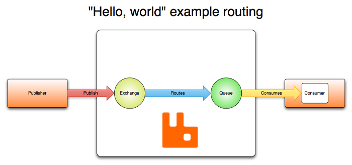
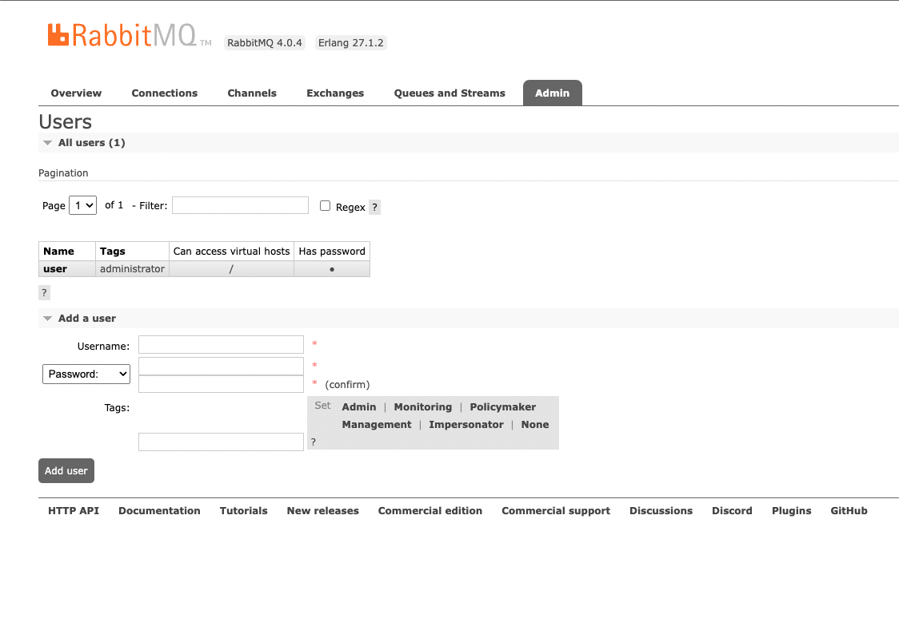
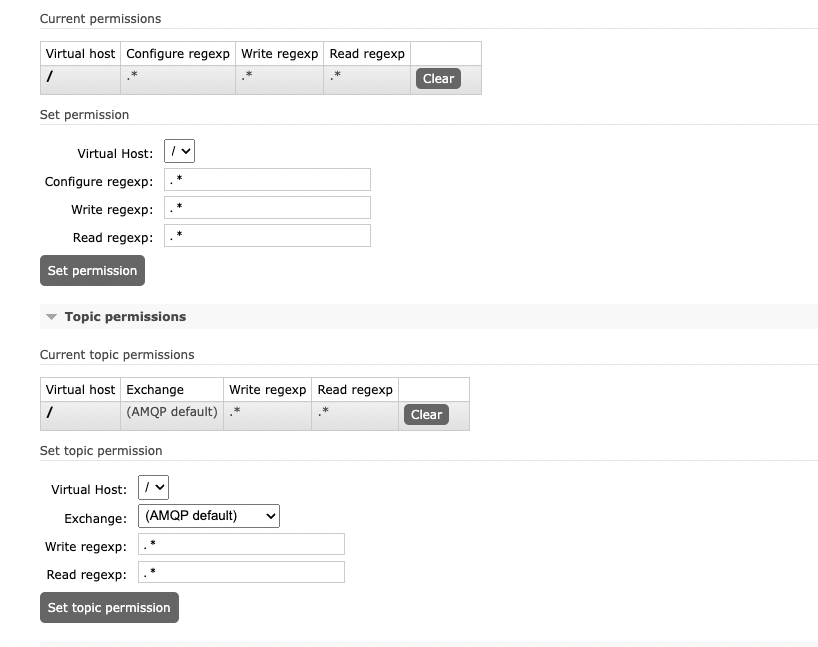
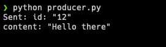
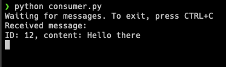

In today's software industry, applications are becoming increasingly complex, moving beyond simple server-client relationships. Infrastructure complexity has grown significantly with the shift toward Microservices Architecture. In this approach, software is broken down into smaller, independent services. With these separate components, ensuring effective communication between services is crucial.

While synchronous communication remains common, it isn't always ideal due to its blocking nature. Asynchronous communication offers greater flexibility, allowing services to send messages without waiting for responses, thus enabling them to continue with other tasks.

Asynchronous communication requires a message-based system. In this setup, services communicate through an intermediary called a message broker rather than communicating directly with each other.

## RabbitMQ



RabbitMQ is one of the most popular open-source message brokers for building message-based systems. It supports multiple protocols, with AMQP being the most widely used. AMQP (Advanced Message Queuing Protocol) enables compatible client applications to communicate with messaging middleware brokers. While we won't cover RabbitMQ's architecture in detail here, you can learn more about it [here](https://www.rabbitmq.com/tutorials/amqp-concepts).

As shown on the image, the base architecture of RabbitMQ consists of Publishers (or Producers) that send messages to an Exchange. The Exchange then routes these messages to Queues, where they are stored until retrieved by Consumers.

## Protocol Buffers (Protobuf)

While various data serialization formats like JSON can be used for publishing messages, we'll use Protocol Buffers (Protobuf). Protocol Buffers, created by Google, is a language-neutral, platform-neutral, and extensible mechanism for serializing structured data. Think of it as XML, but smaller, faster, and simpler. You define your data structure once, then use generated source code to easily read and write structured data across different data streams and programming languages.

### Why use Protobuf over others?

Protobuf known for being a compact, efficient, and compatible binary format for serializing. Here are the key reasons:

1. Message are relatively small compared to JSON due to Protobuf's binary serialization format.
2. It offers faster serialization and deserialization speeds than JSON because it's designed for optimal performance.
3. Its strict schema definition prevents schema violations and reduces error risks, while ensuring reliable structure between producers and consumers.
4. It maintains backward compatibility—you can add or remove fields without breaking existing code, and your code will handle new messages smoothly, as long as you follow the simple practice

## Requirements

1. Make sure you have Docker, Python
2. Install Protobuf compiler, follow this [guide](https://grpc.io/docs/protoc-installation/)

Without a further ado, let’s jump to the code

## Code

### Configure RabbitMQ

First, we need to run RabbitMQ docker container, here I use image `rabbitmq:management` and I set the default user to `user` and default password to `password` for admin to login to dashboard.

```bash
docker run -d --hostname my-rabbit-mg -p 5672:5672 -p 15672:15672 -e RABBITMQ_DEFAULT_USER=user -e RABBITMQ_DEFAULT_PASS=password --name rabbitmq-container rabbitmq:management
```

And then access:

[`http://localhost:15672/#/users`](http://localhost:15672/#/users) and login using `user:password`



We need to add our user permission, click the `user` under the column `Name` on the table and then click `Set permission`



That’s all for RabbitMQ, now we will jump to the code

### Protobuf Code

create a new `message.proto` file

```protobuf
syntax = "proto3";

package protoapp;

message Message {
    string id = 1;
    string content = 2;
}
```

We will create a simple message structure. We named our message type named as `Message` with 2 fields which are `id` and `content` .

When declaring a field, we need to assign field with field number, a unique identifier. It used internally by Protobuf to encode and decode message. That’s all, a simple message structure. Now, we need to compile it using `protoc`

```bash
protoc --python_out=. message.proto
```

It will generate a python code `message_pb2.py` we will later import the generated python code on our code.

### Python Part

Before we start coding, let's install the required packages: `pip install pika protobuf`

Once the installation is complete, we'll create a producer code file named `producer.py`

```python
import pika
from message_pb2 import Message

def produce():
    # connect to rabbitmq
    credentials = pika.PlainCredentials('user', 'password')
    connection = pika.BlockingConnection(pika.ConnectionParameters('localhost', credentials=credentials))
    channel = connection.channel()

		# Declare queue, we named our queue `message_queue`
    channel.queue_declare(queue='message_queue')

    # Declare a protobuf message
    # For example we will just send message with 12 for "id" field
    # and "Hello there" for "content" field
    message = Message()
    message.id = "12"
    message.content = "Hello there"

    # Serialize the message
    serialized_message = message.SerializeToString()

    # Publish the message
    channel.basic_publish(
        exchange='',
        routing_key='message_queue',
        body=serialized_message
    )
    print("Sent:", message)

    # Close connection
    connection.close()

if __name__ == "__main__":
    produce()

```

The code is documented with inline comments explaining each step and since the code is quite simple should be easy to understand. We will not jump to write complex producer/consumer code for now.

Now let’s write the consumer code `consumer.py`

```python
import pika
from message_pb2 import Message

def callback(ch, method, properties, body):
    # Deserialize the protobuf message
    message = Message()
    message.ParseFromString(body)

    # Process the message
    print("Received message:")
    print(f"ID: {message.id}, content: {message.content}")

def consume():
    # Connect to rabbitmq
    credentials = pika.PlainCredentials('user', 'password')
    connection = pika.BlockingConnection(pika.ConnectionParameters('localhost', credentials=credentials))
    channel = connection.channel()

    # declare a queue
    channel.queue_declare(queue='message_queue')

    # Subscribe to the queue
    channel.basic_consume(queue='message_queue', on_message_callback=callback, auto_ack=True)

    print("Waiting for messages. To exit, press CTRL+C")
    channel.start_consuming()

if __name__ == "__main__":
    consume()

```

The code is straightforward, we create a connection to RabbitMQ and set up a callback function that deserializes and prints the message.

Now, let’s try to run it

First let’s run `python producer.py`



As you can see, it will not waiting for the message received, as long as the message published, the task is completed, that’s why it’s non-blocking or asynchronous communication.

Now the message is on the RabbitMQ Queue, let’s run the consumer `python consumer.py`



It immediately print out the published message: `ID: 12, content: Hello there`  because the message already in the queue and once the consumer running it will consume the message in the queue.

That's all for now! You can find the complete code in this [repository](https://github.com/chud-lori/async-rabbit-python-protobuf). If you have any questions about this post, please open an issue. See you later, cheers 🍻🍻