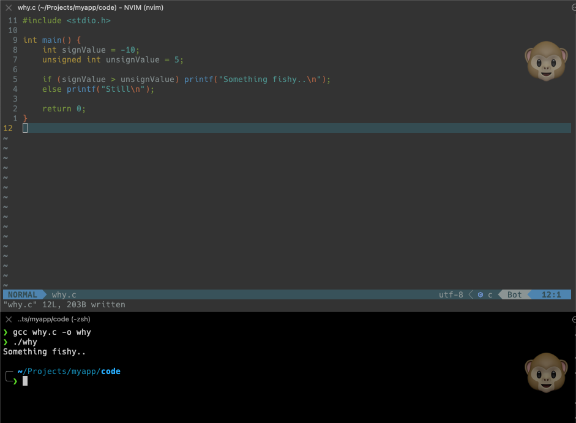
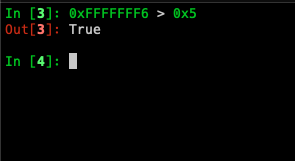
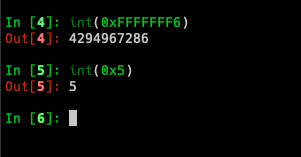
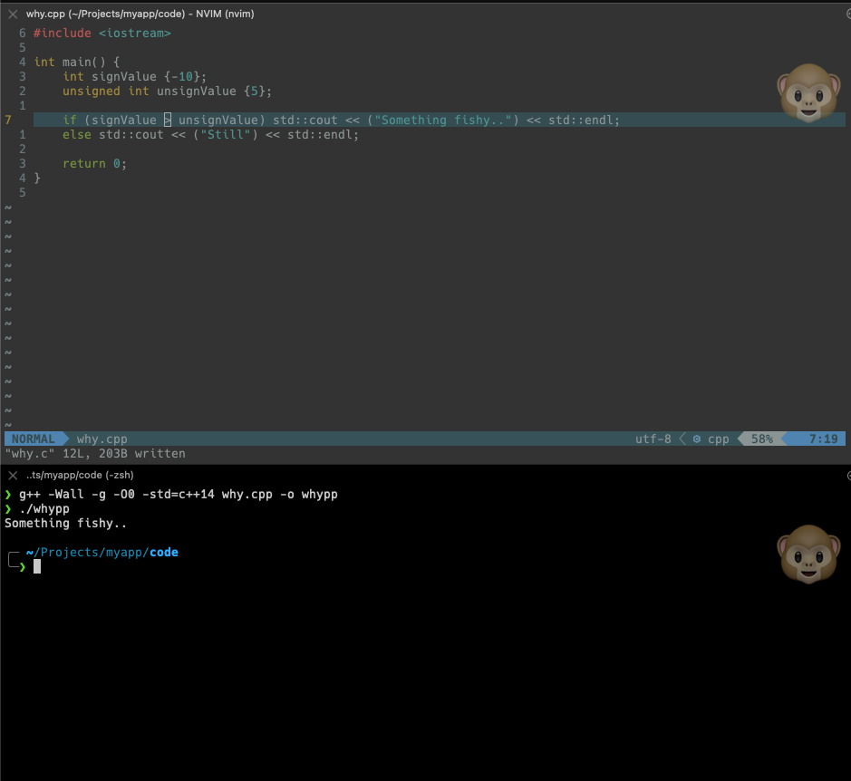

I just scrolling Twitter when I found an interesting tweet about C code screenshot and its behavior, as shown in the attached image, the code looks just fine until you look at code execution result.


Shown in the image that `x > y` which represent as `is -10 higher than 5` and the result of that comparison is said that -10 is higher than 5 by print out string `"this is embarrassing"` , hmmm how could? I didn’t just believe it, and try on my local using this code:
```c
#include <stdio.h>

int main() {
    int signValue = -10;
    unsigned int unsignValue = 5;

    if (signValue > unsignValue) printf("Something fishy..\n");
    else printf("Still\n");

    return 0;
}
```
And boom…


Indeed, the C program has something not right, and then I did a little research what the heck is this behavior, until I found out that this happen because of **Integer Promotion Rules.**

### Signed and Unsigned

But before we talk about that rules, let’s summary what is Signed Integer and Unsigned Integer

**Signed Integers**, a signed integer simply represent value of negative and positive number, by this it uses two’s complement representation

**Unsigned Integers**, an unsigned integer not like signed integer, it merely represents non-negative numbers, so it will store the value as it is

### What is **two’s complement representation**?

Two’s complement representation is common way to represent signed integers in binary, it ensures that the most significant bit (MSB), the bit in a binary number with the highest value— usually the leftmost bit in a binary, it indicates the sign `0` for positive number and `1` for negative number.

This is how the numbers are represented:

1. We know that positive number represented as usual in binary
2. Negative numbers represented in this small steps:
    1. Writing the binary
    2. Flipping each bits
    3. Adding `1` to the result

For example, let’s say in 32-bit system with number -29:

1. The binary for -29 is : `00000000 00000000 00000000 00011101`
2. Flip each bits: `11111111 11111111 11111111 11100010`
3. Add 1: `11111111 11111111 11111111 11100011`

And the hex for that is `0xFFFFFFE3` which is the two’s complement representation of -29

So in the above screenshot code, the -10 will represent as `11111111 11111111 11111111 11110110` or `0xFFFFFFF6` , while 5 will represent as `00000000 00000000 00000000 00000101` or `0x5` which mean `0xFFFFFFF6` is higher than `0x5`


or in decimal numbers `4294967286` for `0xFFFFFFF6` and 5 for `0x5`



This rules also applied on C++, I tried in C++14


### How to avoid that then?

I would personally to check the negative value first to avoid such cases, if the first value is negative then I will just return the value immediately, just keep it simple lol.

But, we can also cast the unsigned integer into signed integer during comparison
`(signValue > (int)unsignValue)`

That’s all, thanks for visit and reading this, cheers!!!
